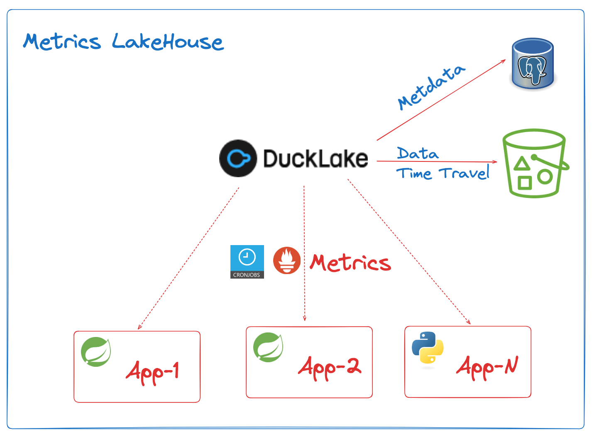

DuckDB Prometheus/OpenMetrics extension
========================================

This is a DuckDB extension to query metrics data from Prometheus and OpenMetrics.

Features:

- Prometheus support: `prometheus(url_or_path, source)`
- OpenMetrics support: `openmetrics(url_or_path, source)`

Why build this extension? I want a $10/Month metrics system, and DuckLake is a good choice for that.



# Usage

Prometheus metrics query:

```
$ duckdb -unsigned -cmd "install openmetrics; load openmetrics;"
duckdb> select * from prometheus('http://localhost:8888/actuator/prometheus','');
```

Function `prometheus(url_or_path, source)` and `openmetrics(url_or_path, source)` take two parameters:

- `url_or_path`(required): The URL or file path to the Prometheus or OpenMetrics endpoint.
- `source`(required): A string representing the source of the metrics. If `source` is empty(`''`), `source` will be
  endpoint(
  host+port) of url or file path.

# Metrics data table

Columns of metrics data:

- `metric_name`: The name of the metric.
- `metric_type`: The type of the metric (e.g., counter, gauges).
- `value`: The value of the metric as a floating-point number.
- `unit`: The unit of the metric, such as `seconds`, `bytes`, etc.
- `labels`: A JSON object containing the labels associated with the metric.
- `source`: source of the metric, e.g., `127.0.0.1:8080`.
- `timestamp`: The timestamp of the metric in milliseconds since epoch.
- `details`: A JSON object containing additional details about the metric, such as summary percentiles and histogram
  buckets.

`metrics` table schema:

```sql
create table metrics
(
    metric_name varchar   not null,
    metric_type varchar   not null,
    value double not null,
    unit        varchar,
    labels      text,
    source      varchar,
    timestamp   timestamp not null,
    details     varchar
);
```

# Build and Install

- Get the source code: `git clone https://github.com/linux-china/duckdb-openmetrics.git`
- Change to the directory: `cd duckdb-openmetrics`
- Pull submodules: `git submodule update --init --recursive --depth=1`
- Configuration: `make configure`
- Build the extension: `make release`
- Install the extension: `make install`

# FAQ

### Could I run a cron job to fetch metrics?

You can use DuckDB's [cronjob extension](https://duckdb.org/community_extensions/extensions/cronjob.html) to create
tasks that run periodically to fetch metrics from Prometheus or OpenMetrics endpoints and store them in the `metrics`
table.

The SQL to insert metrics data into the `metrics` table from a Prometheus endpoint is as follows:

```sql
INSERT INTO metrics
SELECT *
FROM prometheus('http://localhost:8888/actuator/prometheus', '');
```

Create a cron job to run this SQL periodically:

```sql
-- Runs every 5 minutes
SELECT cron('INSERT INTO metrics SELECT * FROM prometheus(''http://localhost:8888/actuator/prometheus', '''')', '* 5 * * * *'); 
```

### Could I query multiple Prometheus endpoints?

Yes, you can query multiple Prometheus endpoints by using the `UNION` operator in SQL.

```sql
SELECT *
FROM prometheus('http://192.168.1.2:8888/actuator/prometheus', '')
Union
SELECT *
FROM prometheus('http://192.168.1.2:8888/actuator/prometheus', '')
```

### JSON process for labels and details

`labels` and `details` columns are stored as JSON text(not JSON type). You can use DuckDB's JSON functions to process
them.

```sql
select metric_name, metric_type, value, labels
from metrics
where starts_with(labels, '{')
  and json_extract(labels::JSON, '$.area') = '"heap"';
```

**Attention**: There is no JSON type in [DuckLake Data Types](https://ducklake.select/docs/stable/specification/data_types), 
and now `labels` and `details` columns are stored as JSON text.

# Todo

- Native map type for `labels` column: https://github.com/duckdb/duckdb-rs/issues/81

# References

* Prometheus specification: https://prometheus.io/docs/concepts/data_model/
* OpenMetrics specification: https://github.com/prometheus/OpenMetrics/blob/main/specification/OpenMetrics.md
* Template for Rust-based DuckDB
  extensions: https://github.com/prometheus/OpenMetrics/blob/main/specification/OpenMetrics.md
